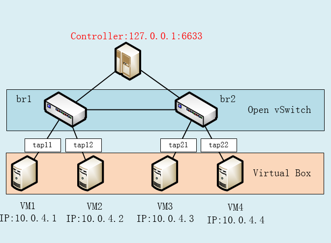
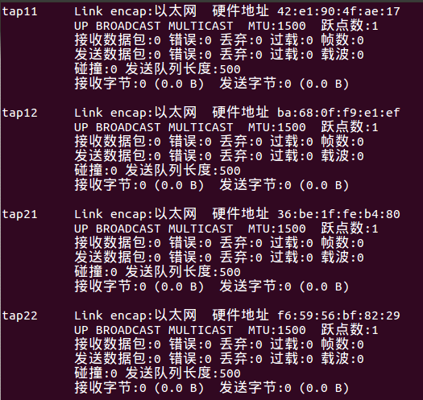
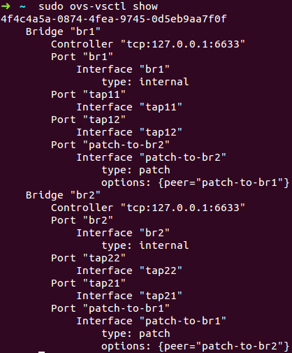
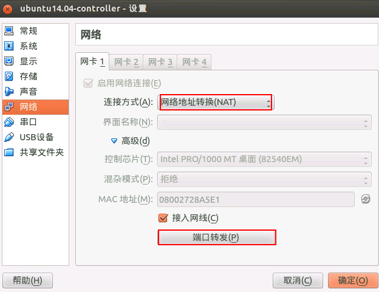
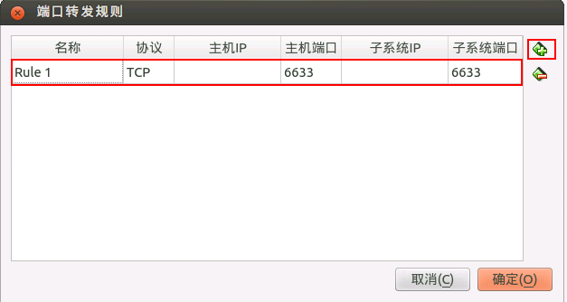
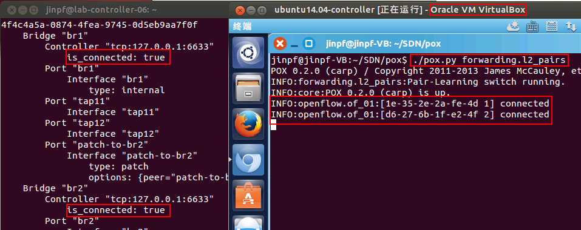

#OVS连接Vbox组网配置

##示例网络拓扑

##添加虚拟网卡

tun/tap驱动程序实现了虚拟网卡的功能，可参考：[http://zh.wikipedia.org/wiki/TUN%E4%B8%8ETAP](http://zh.wikipedia.org/wiki/TUN%E4%B8%8ETAP "http://zh.wikipedia.org/wiki/TUN%E4%B8%8ETAP")利用tun/tap驱动，可以将tcp/ip协议栈处理好的网络分包传给任何一个使用tun/tap驱动的进程，由进程重新处理后再发到物理链路中。开源项目openvpn（[http://openvpn.sourceforge.net](http://openvpn.sourceforge.net)）和Vtun([http://vtun.sourceforge.net](http://vtun.sourceforge.net))都是利用tun/tap驱动实现的隧道封装。(详见：[http://www.ibm.com/developerworks/cn/linux/l-tuntap/](http://www.ibm.com/developerworks/cn/linux/l-tuntap/))

<!--lang:shell-->
	# ip tuntap help 可以查看命令用法
	sudo ip tuntap add mode tap tap11
	sudo ip tuntap add mode tap tap12
	sudo ip tuntap add mode tap tap21
	sudo ip tuntap add mode tap tap22

	sudo ip link set tap11 up
	...

	# 之后删除tap设备命令：
	sudo ip tuntap del mode tap tap11
	...

##Vbox虚拟机桥接虚拟网卡
在 virtualbox 虚拟机管理器中虚拟机网络选择桥接以上虚拟网卡。在虚拟机中配置 ip 地址

##OVS组网
<!--lang:shell-->
	# 添加网桥
	sudo ovs-vsctl add-br br1
	sudo ovs-vsctl add-br br2

	# 端口绑定到网桥
	sudo ovs-vsctl add-port br1 tap11
	sudo ovs-vsctl add-port br1 tap12
	...

	# 网桥间互联
	sudo ovs-vsctl add-port br1 patch-to-br2 -- set interface patch-to-br2 type=patch options:peer=patch-to-br1
	sudo ovs-vsctl add-port br2 patch-to-br1 -- set interface patch-to-br1 type=patch options:peer=patch-to-br2

	# 网桥连控制器
	sudo ovs-vsctl set-controller br1 tcp:127.0.0.1:6633
	sudo ovs-vsctl set-controller br2 tcp:127.0.0.1:6633
	
	# 查看效果：
	sudo ovs-vsctl show

##控制器
###直接在主机中安装控制器
可以采用不同控制器进行控制，以 POX 为例，下载:[https://github.com/noxrepo/pox](https://github.com/noxrepo/pox "https://github.com/noxrepo/pox") 执行以下命令为控制器下发流表： 
<!--lang:shell-->
	cd pox
	./pox.py forwarding.l2_pairs
###在虚拟机中安装控制器
控制器安装在虚拟机中，主机和虚拟机通信可以采用 `桥接` 的方式，也可以采用 `NAT` 的方式，设置如下：

同样开启控制器，显示如下：

##流量监控
br1、br2设置 Agent IP：
<!--lang:shell-->
	ifconfig br1 10.0.4.251 netmask 255.0.0.0
	ifconfig br1 up
	ifconfig br2 10.0.4.252 netmask 255.0.0.0
	ifconfig br2 up

##简单测试
主机之间互 Ping ，可以 Ping 通