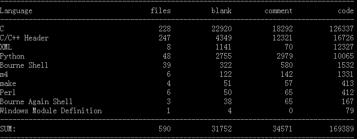
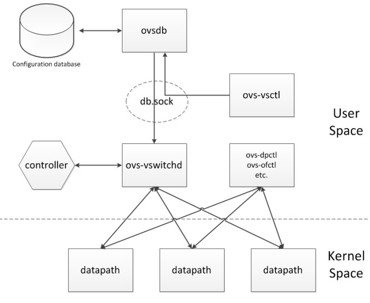
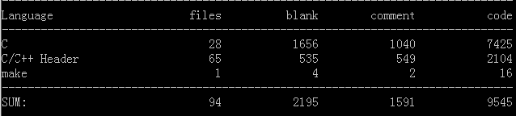
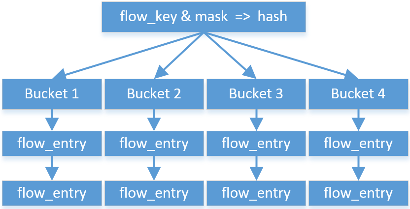

#Open vSwitch代码简要总结
Open vSwitch是一个高质量的、多层虚拟交换机，其目的是让大规模网络自动化，可以通过编程扩展,同时仍然支持标准的管理接口和协议（例如NetFlow、sFlow、SPAN、RSPAN、CLI、LACP、802.1ag）。

其主要实现代码为可移植的C代码。本次分析最新版的ovs-2.1.2，代码量经统计(采用cloc进行统计)：

##整体框架和实现原理

OVS中重要的组件是ovs-vswitchd，其实现了OpenFlow交换机的核心功能，通过netlink协议直接和OVS的内核模块进行通信。其代码主要位于 `vswitchd/`目录中。

ovsdb数据库主要保存ovs-vswitchd的配置信息，其可以使OVS交换机的配置能够被持久化存储，即便设备重启后相关配置仍旧能存在。其代码主要位于 `ovsdb/`目录中。

datapath模块主要实现底层交换机机制，负责接收网包-查流表-执行action，如果查表匹配失败就调用 `upcall`给userspace的vswitchd处理。其代码主要位于 `datapath/`目录中。

当然，除此之外还有其它一些辅助模块，这里不做详细分析。

**因此，如果要进行流表压缩，就要修改流表结构，修改查询流表的函数、可能会修改执行action的函数。经过几天代码阅读，推断其应该就在datapath模块中。**因此，以下详细分析 `datapath/`文件夹下的代码。

##datapath模块
datapath模块的代码量统计：

###flow_table
经过我的分析，流表数据结构和流表相关操作定义在 `datapath/flow_table.h-flow_table.c`中。

流表结构：

其存储结构貌似是用类似于hashmap的结构进行存储和优化查找。hashmap类似一个链表数组，hash值相同的表项在同一个链表中（或称为bucket，桶），因此大量的流表项可以被分到若干个桶中，而hash算法决定桶的数量，通过计算要查找流表特征值的hash值可以快速定位其在那个桶中，这样可以快速缩减查找范围。

<!--lang:c-->
	struct table_instance {
		struct flex_array *buckets;	
		//flex_array貌似是弹性数组，buckets是一个存放bucket头指针的数组（有待验证）
		unsigned int n_buckets;
		struct rcu_head rcu;
		int node_ver;
		u32 hash_seed;	//哈希算法需要的种子
		bool keep_flows;	//是否保留该流表项
	};

	struct flow_table {
		struct table_instance __rcu *ti;
		struct list_head mask_list;
		unsigned long last_rehash;
		unsigned int count;
	};

相关操作：
<!--lang:c-->
	int ovs_flow_tbl_init(struct flow_table *);	//流表初始化
	void ovs_flow_tbl_destroy(struct flow_table *table, bool deferred);	//流表销毁
	int ovs_flow_tbl_insert(struct flow_table *table, struct sw_flow *flow,
			struct sw_flow_mask *mask);	//流表项插入
	void ovs_flow_tbl_remove(struct flow_table *table, struct sw_flow *flow);	//流表项删除
	struct sw_flow *ovs_flow_tbl_lookup(struct flow_table *,
				    const struct sw_flow_key *);	//流表项查找
	...
	...

###flow
流表项的定义和流的解析函数定义在 `datapath/flow.h-flow.c`中。

其中数据结构：
<!--lang:c-->
	struct sw_flow {
		struct rcu_head rcu;
		struct hlist_node hash_node[2];		//rehash使用
		u32 hash;	//存hash值

		struct sw_flow_key key;		//在该文件中有定义，网络数据的特征值，包括源目的mac、ip
		struct sw_flow_key unmasked_key;
		struct sw_flow_mask *mask;
		struct sw_flow_actions __rcu *sf_acts;
		struct sw_flow_stats stats;
	};

相关操作：
<!--lang:c-->
	int ovs_flow_extract(struct sk_buff *, u16 in_port, 
		struct sw_flow_key *);	//从数据包sk_buff提取关键信息到sw_flow_key中
	void ovs_flow_stats_update(struct sw_flow *flow, struct sk_buff *skb);	//更新流表状态
	...
	...

###datapath
牵扯到流表和其它接口交互的操作应该基本都定义在 `datapath/datapath.h-datapath.c`中。

数据结构：
<!--lang:c-->
	struct datapath {
		struct rcu_head rcu;
		struct list_head list_node;
	
		/* Flow table. */
		struct flow_table table;
	
		/* Switch ports. */
		struct hlist_head *ports;
	
		/* Stats. */
		struct dp_stats_percpu __percpu *stats_percpu;
	
	#ifdef CONFIG_NET_NS
		/* Network namespace ref. */
		struct net *net;
	#endif
	
		u32 user_features;
	};

相关操作：
<!--lang:c-->
	void ovs_dp_process_received_packet(struct vport *, 
		struct sk_buff *);	//处理从端口接收到的数据包
	int ovs_dp_upcall(struct datapath *, struct sk_buff *, 
		const struct dp_upcall_info *);	//向用户态上传未查到表的数据
	int ovs_execute_actions(struct datapath *dp, 
		struct sk_buff *skb);	//对数据执行相应的操作
	...
	...

###action
此外，执行具体操作的函数在 `datapath/actions.c`中定义，比如：
<!--lang:c-->
	static int pop_vlan(struct sk_buff *skb);	//去vlan标签
	static int push_vlan(struct sk_buff *skb, 
		const struct ovs_action_push_vlan *vlan);		//加vlan标签
	static int set_eth_addr(struct sk_buff *skb,
			const struct ovs_key_ethernet *eth_key);	//更改以太网地址
	static void set_ip_addr(struct sk_buff *skb, struct iphdr *nh,
				__be32 *addr, __be32 new_addr);		//更改IP地址
	static int do_output(struct datapath *dp, struct sk_buff *skb, 
		int out_port)；	//从某个端口发出去
	...
	...

###基本流程分析
当数据包从OVS某个端口发来时，OVS在内核状态下查流表看如何处理，要查流表，首先要从原始数据中提取出关键信息（key，比如ip、mac之类），然后根据这些信息去查表，获取对于这条流应该执行的操作，之后再执行相应的操作。如果没有查到匹配的流表项，就执行upcall操作，应该就是要让OVS发送packetout消息。

