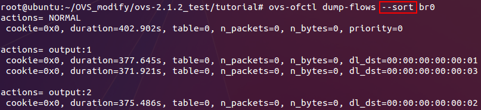
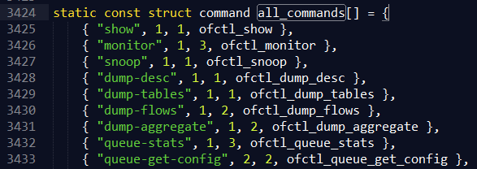

#ovs-ofctl代码修改及测试
本次完成 `ovs-ofctl` 流表查看工具的代码修改及基本测试。更多实际测试有待后续应用方案完成再进行。
##ovs-ofctl简要分析
`ovs-ofctl` 工具是一个管理OpenFlow交换机的命令行工具，其不仅局限于Open vSwitch。（如果安装过该工具通过在liunx下执行 `man ovs-ofctl`便可以看到详细使用说明。）

**注意：其和 Open vSwitch是完全两码事！改其代码不会影响 OVS，改 OVS 代码重构流表项在 ovs-ofctl 中也不会有所体现！但是可以通过修改ovs-ofctl的展示效果来体现修改流表的效果。**

##修改后测试及效果显示
###测试用例
目前测试只基于一个交换机，对其下发流表进行测试。
故添加一个网桥（交换机）：
<!--lang:shell-->
	ovs-vsctl add-br br0

添加流表项：
<!--lang:shell-->
	ovs-ofctl add-flow br0 "dl_dst=00:00:00:00:00:01 actions=output:1"
	ovs-ofctl add-flow br0 "dl_dst=00:00:00:00:00:02 actions=output:2"
	ovs-ofctl add-flow br0 "dl_dst=00:00:00:00:00:03 actions=output:1"

查看流表：
<!--lang:shell-->
	ovs-ofctl dump-flows br0
	ovs-ofctl dump-flows --sort br0

###显示效果
修改前：

修改后：

###关于ovs-ofctl此外可以尝试的命令

在添加网桥后可以看一下以下命令执行的结果
<!--lang:shell-->
	ovs-ofctl dump-tables br0
	ovs-ofctl dump-ports br0
	ovs-ofctl queue-stats br0

关于action也可以执行以下命令：
<!--lang:shell-->
	ovs-ofctl add-flow br0 "dl_dst=00:00:00:00:00:01 actions=output:1"
	ovs-ofctl add-flow br0 "dl_dst=00:00:00:00:00:01 actions=controller(reason=invalid_ttl)"
	ovs-ofctl add-flow br0 "dl_dst=00:00:00:00:00:01 actions=mod_nw_src:192.168.1.2"

##ovs-ofctl整体框架
首先，其所有代码是在 `utilities/ovs-ofctl.c` 中，其执行过程就是通过从命令行读取指令，然后分析指令，执行指令。所以其主函数：

所以其执行函数中包括 `parse_options()` 来分析指令， `run_command()` 来执行指令，其中关于所有可用指令的集合通过分析函数的层层嵌套，发现其定义在：

其中每项第一个元素应该就是命令行指令，最后一个元素应该就是该指令执行需要调用的函数。

**本次修改主要是针对流表查看效果的更改，故真正涉及修改的文件及函数包括以下： `utilities/ovs-ofctl.c` 中的 `ofctl_dump_flows__()` 和 `ofctl_dump_flows()`函数**（其中前者执行未加参数的 `dump-flows`指令，后者执行加参数的该指令）**以及 `lib/ofp-print.c` 中的 `ofp_print_flow_stats()` 函数**(其完成单条流的打印操作)

##源代码关键函数及数据结构（备忘）
相关字符处理函数及数据结构：
<!--lang:c-->
	struct ds s;	//存储字符串数据用
	ds_init(&s);	//初始化
	ds_clear(&s);	//清空字符串
	ds_put_cstr(&s,char *string)	//将string字符串追加到s中
	char *string=ds_cstr(&s);	//将s中字符串以字符数组的形式返回
	ds_destroy(&s);	//回收s数据结构

	//定义在 lib/ofp-print.c 中，将流表项fs格式化排列成字符串追加到ds中
	void fp_print_flow_stats(struct ds *, struct ofputil_flow_stats *fs)

	//定义在 lib/ofp-actions.c 中，解析流表action字段，将其排成字符串追加到ds中
	void ofpacts_format(const struct ofpact[], size_t ofpacts_len, struct ds *)