#OVS datapath模块代码修改
本次修改主要更改 `datapath` 模块代码中的 `datapath.h` 和 `datatpath.c` 文件。为了保证尽量少更改原有代码，并保证代码安全可用，这里仅修改 `sw_flow_action` 指针指向，同时将和真正流表相关的 `sw_flow_action` 结构存放到一个自定义的链表中。

在每次添加流表项时，ovs原有代码都是先新建一个 `sw_flow_action` 的结构体，之后将其指针挂载到流表项 `sw_flow` 结构下，在这里我们做的操作就是在 `sw_flow_action` 挂载之前，将其和我们自定义的链表中已有的进行比较，如果有相同，更改其指针指向，并释放刚才新建立的 `sw_flow_action` 结构，之后还是借用原有代码将其挂载到 `sw_flow` 结构下。如果在比较的时候我们自定义的链表中没有存放，我们就将其组织在我们的链表中，而 `sw_flow_action` 指针没有改变，原有代码还是将其挂载到流表项 `sw_flow` 当中。

流表项action组织方式：

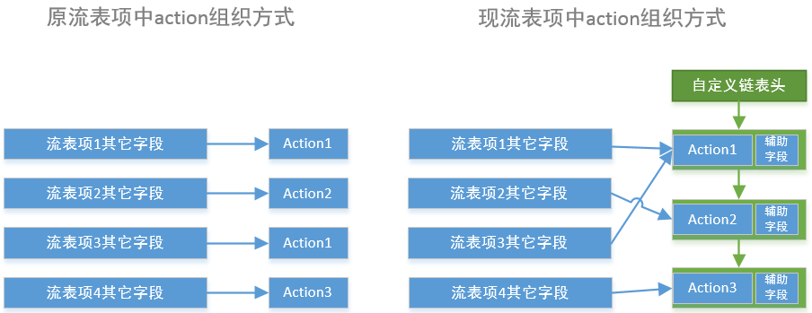

##修改原理
流表项结构：
<!--lang:c-->
	struct sw_flow {
		struct rcu_head rcu;
		struct hlist_node hash_node[2];
		u32 hash;

		struct sw_flow_key key;
		struct sw_flow_key unmasked_key;
		struct sw_flow_mask *mask;
		struct sw_flow_actions __rcu *sf_acts;
		struct sw_flow_stats stats;
	};

其中 `sw_flow_action` 为存储action的结构，定义的 `sf_acts` 变量为流表项 `sw_flow` 的指针。

**以下以流表项的添加、修改和删除为例，简要说明 action 字段指针是如何挂载到流表项中的**

###action字段的生成和挂载
在 `datapath.c` 中有定义外界添加、修改、删除流表的函数：

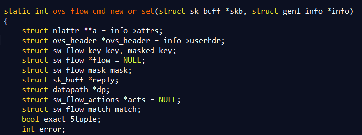

该函数中和 action 字段相关的操作：

* 分配 action (`sw_flow_actions`) 存储空间：

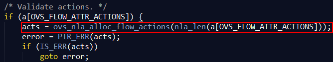

* 给 action (`sw_flow_actions`) 空间赋值，即具体要添加或修改的操作：

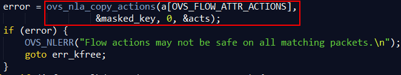

* 将 action (`sw_flow_actions`) 的指针挂载到流表项中，即给 flow->sf_acts 赋值

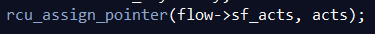

以上便完成流表项 action 字段的产生和挂载。**而为了简化修改，我们所做的操作就是在真正挂载到流表项之前，改变其 action 所指空间。**这样做的好处就是能够尽可能少的改变原有代码，借助别人的代码完成 action 字段的生成以及校验，同时借用别人的代码保证在更改流表项指针时不影响其同步互斥性，借用我们写好的链表操作函数，**只用了一条语句便完成了修改操作**：

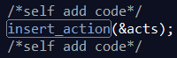

###流表项的新建和修改
其实，该函数实现的操作**包括新建流表项和修改流表项**，关键的分支点在于其先根据**匹配字段**查找原来流表中是否存在相同的流表（action字段不在匹配范围）

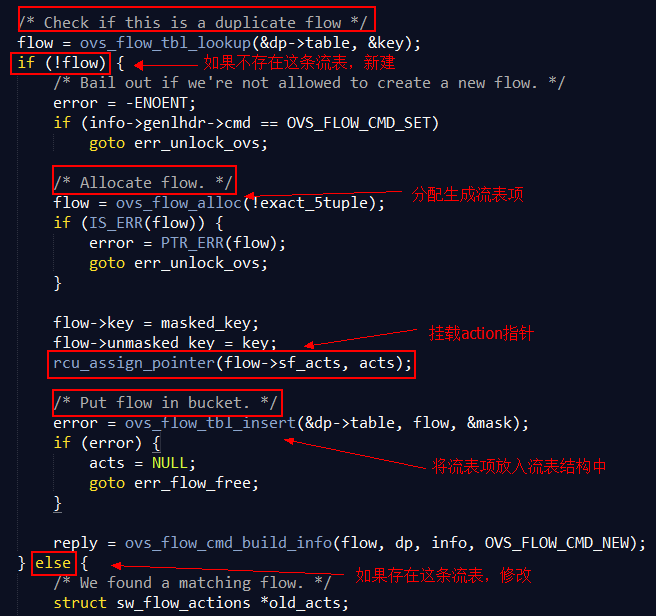

* 如果不存在相同的流，就新建流表项，挂 action 指针，放入流表结构中。
* 如果存在相同的流，其操作同样是挂指针，但是不同的是，其会获得一个以前的 action，这里就牵扯到删除以前 action 的操作。在这里，我们注释掉其原有删除操作，**调用我们自定义的删除操作，进行条件删除，防止多条流表项指向一个action时，该action被清导致其它流表项指空的情况发生。**

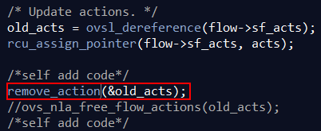

###流表项的删除
该函数同样在 `datapath.c` 中：

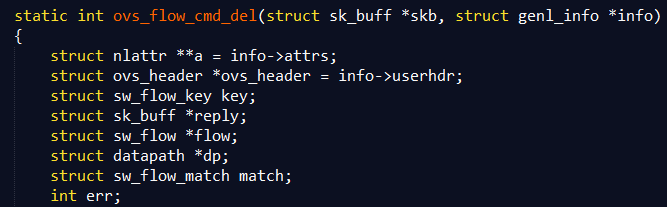

在这里修改操作比较困难。其整体流程应该是:先找到匹配字段对应的流表项flow->然后将flow从流表结构中移除->然后释放该flow的空间。

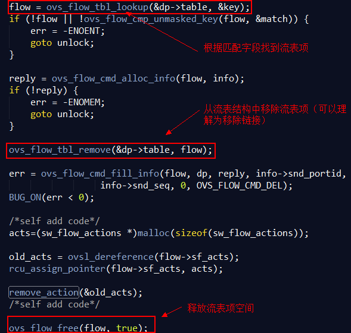

这里因为释放流表项空间的时候调用的 `ovs_flow_free` 函数顺带把 action 字段的空间也给释放了，所以会带来问题。但是调用该函数的地方有很多，比如当新建流表项的时候出错了，也会调用该函数来释放空间。所以，为了避免出错，我就仿照上面修改流表的做法，先分配了一块新的空间，将其指针替换到flow->sf_acts上，对其原有action空间执行条件删除，这样在下面的释放空间函数上其会释放刚才新分配的空间，从而避免出错。（这样做虽说效率不高，但是可以达到尽可能少的修改代码，避免程序运行出错）

##添加数据结构及相关操作
数据结构定义在 `datapath.h` ：
<!--lang:c-->
	typedef struct actions_list_node{
		struct actions_list_node *next;
		int count;	//记录有几个流表项关联到该action
		sw_flow_actions * action;	//指向sw_flow_actions结构的指针
	}a_head,a_node;
数据结构相关操作：
<!--lang:c-->
	//链表初试化函数，初始化链表头部
	void init_actions_list(void);
	//清空链表，删除相关结构
	void destory_actions_list(void);
	//比较两个action的内容是否相同
	int flow_action_equal(sw_flow_actions * action1,sw_flow_actions * action2);
	//流表项添加action，修改相关记录和action指针
	void insert_action(sw_flow_actions ** action);
	//流表项删除action，修改相关记录和action指针
	void remove_action(sw_flow_actions ** action);
其中初始化和清空在datapath初始化和清空时调用，其定义在 `datapath.c` 中，函数为 `dp_init
` 和 `dp_cleanup`。

##实际调试
###安装配置
同以前一样，执行以下命令安装OVS：
<!--lang:shell-->
	# configure and build
	sudo ./boot.sh
	sudo ./configure
	sudo make
	#install
	sudo make install
	#Initialize the configuration database using ovsdb-tool
	mkdir -p /usr/local/etc/openvswitch
	sudo ovsdb-tool create /usr/local/etc/openvswitch/conf.db vswitchd/vswitch.ovsschema
	#start up
	ovsdb-server --remote=punix:/usr/local/var/run/openvswitch/db.sock \
                     --remote=db:Open_vSwitch,Open_vSwitch,manager_options \
                     --private-key=db:Open_vSwitch,SSL,private_key \
                     --certificate=db:Open_vSwitch,SSL,certificate \
                     --bootstrap-ca-cert=db:Open_vSwitch,SSL,ca_cert \
                     --pidfile --detach
	ovs-vsctl --no-wait init
	ovs-vswitchd --pidfile --detach
安装mininet（关于mininet和ovs的安装先后顺序有待调研）
<!--lang:shell-->
	sudo apt-get install mininet
(这样安装会提示缺少东西，不过貌似不影响最后使用)
###执行命令测试
<!--lang:shell-->
	sudo mn --topo=tree,2,2
测试如下图：

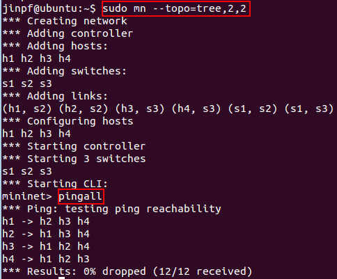

没有问题

执行查看流表命令：

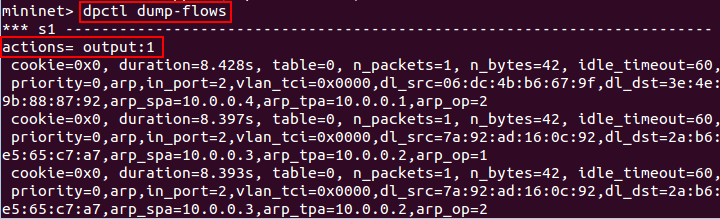

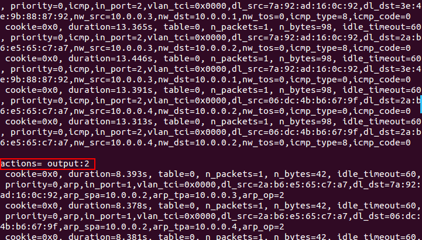

和之前测试显示效果一致

显示版本：

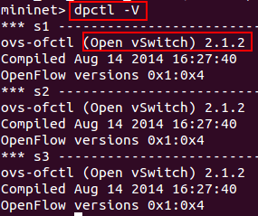

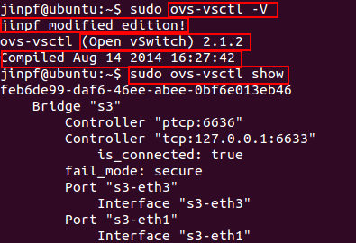

**目前，简单测试没有问题。晚上，刘鹏也进行了相关的测试，他反映放上他的应用应该也没有问题。**