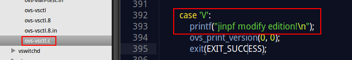
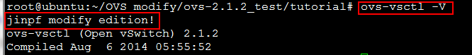

##暂行OVS测试方法
首次下载源码后，如果采用 `git clone`方式下载，则进主目录执行：
<!--lang:shell-->
	./boot.sh
正常下载 `release`版本直接进主目录。
运行：
<!--lang:shell-->
	sudo ./configure  [option]
其中[option]可为：

* `--enable-Werror` 其代表在编译时会显示warning信息
* `CC=gcc-4.2` 或 `CC=clang` 其代表用gcc-4.2或clang编译
* `--prefix=/usr --localstatedir=/var` 其代表软件安装在 `/usr` 下，可执行文件放在 `/var` 中

###之后在首次或是每次更改完代码后执行以下操作
在源代码主文件夹中执行：
<!--lang:shell-->
	sudo make
之后
<!--lang:shell-->
	cd tutorial/
	sudo ./ovs-sandbox -b ..
之后shell便进入沙盒环境中，部分界面显示如下：
<!--lang:shell-->
	----------------------------------------------------------------------
	You are running in a dummy Open vSwitch environment.  You can use
	ovs-vsctl, ovs-ofctl, ovs-appctl, and other tools to work with the
	dummy switch.  
	
	Log files, pidfiles, and the configuration database are in the
	"sandbox" subdirectory.
	
	Exit the shell to kill the running daemons.
此时可以在不安装OVS的情况下运行相关命令在沙盒中进行测试，具体测试可以参见[Open vSwitch Advanced Features Tutorial](http://git.openvswitch.org/cgi-bin/gitweb.cgi?p=openvswitch;a=blob_plain;f=tutorial/Tutorial;hb=HEAD)

之后如果要退出沙盒环境可以执行：
<!--lang:shell-->
	exit

#这样做是可行的！！！
经过真实更改测试，只修改了 `utilities/ovs-vstcl.c`的一点代码：

经过 `make`（的确是增量的make，修改多少，就新编译多少文件），然后：

